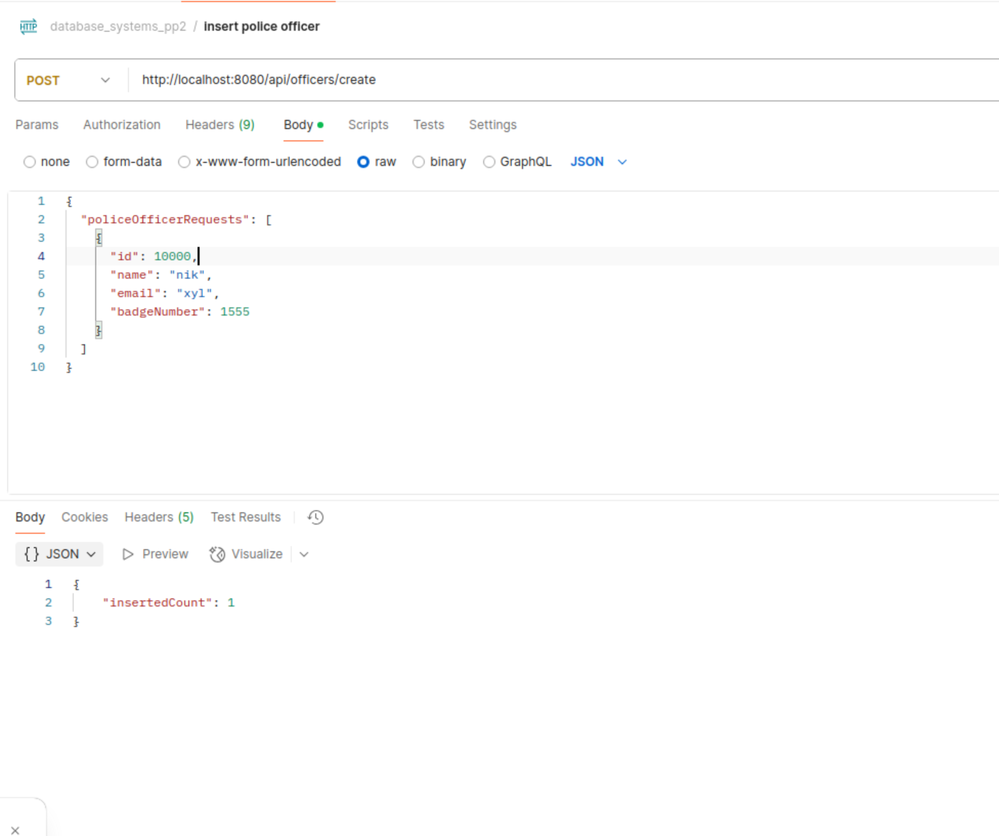
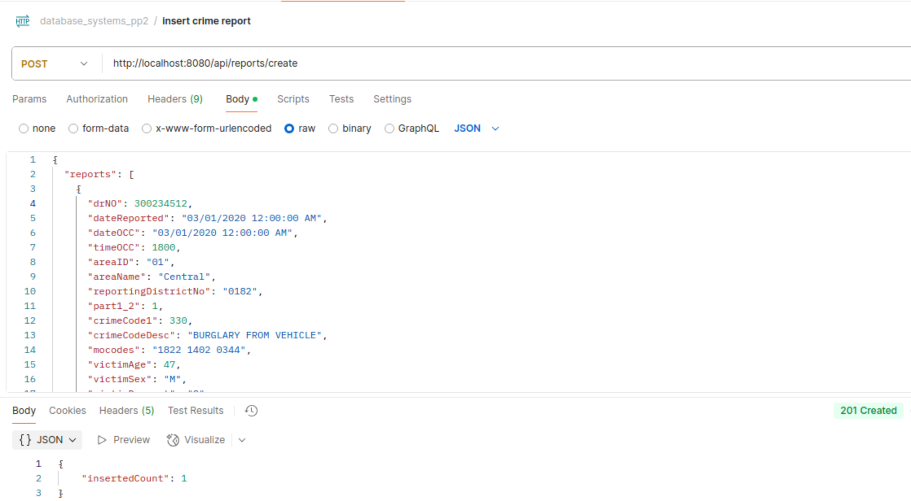
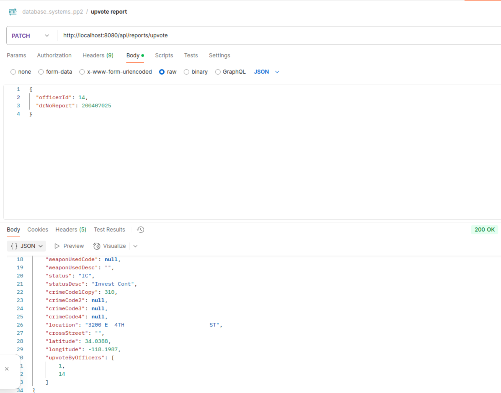
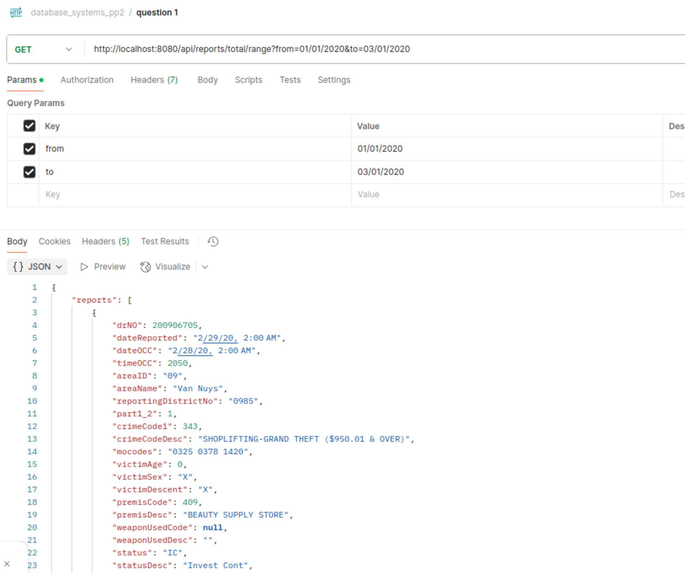
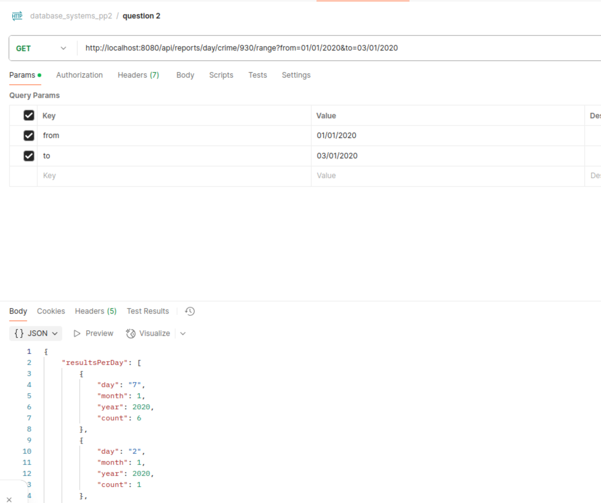

# Database Systems Project 2
The project demonstrates a web application which utilizes mongo. Also, important keys of the project involve:

* Utilization of a simple containerized mongoDB
* Hexagonal architecture with separation in layers
* Lambda and some java8 + features
* Queries and aggregations in mongoDB
* Spring concepts like running scripts on startup
* Data generation
* Postman collection
* Manipulation of dates in mongoDB as they are saved in utc by default
* Mapstruct

## Description of the schema design

The database is constituted by two collections _crime_reports_ and _police_officers_. Data were inserted as raw.
_crime_reports_ along with id and upvoteByOfficers field has 29 columns while _police_officers_ is kept simple.

## Queries
Queries can be found in classes:
* CrimeRepositoryImpl.class
* PoliceOfficerDocumentRepositoryImpl.class

## Github link

https://github.com/VicangelNik/database_systems_project_2

## Sample responses

